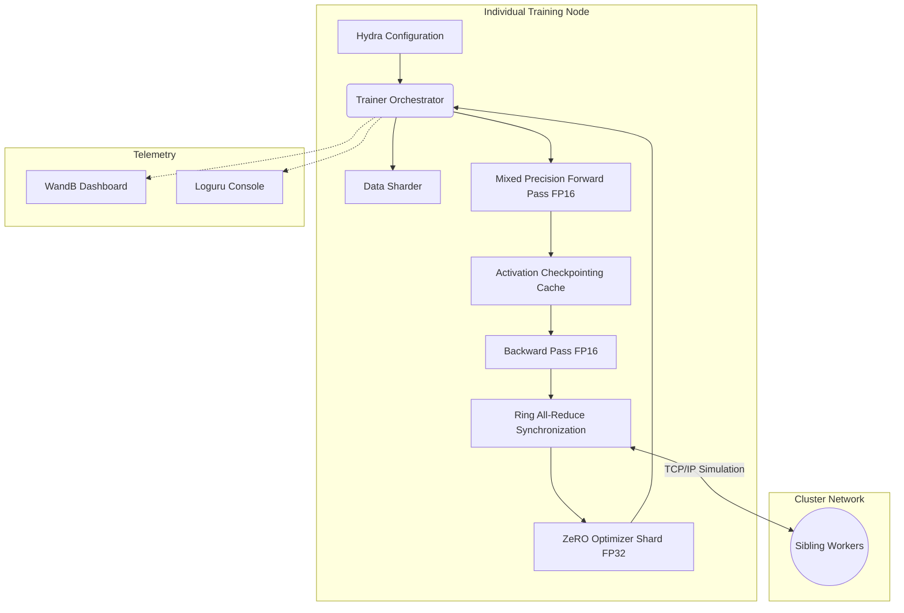
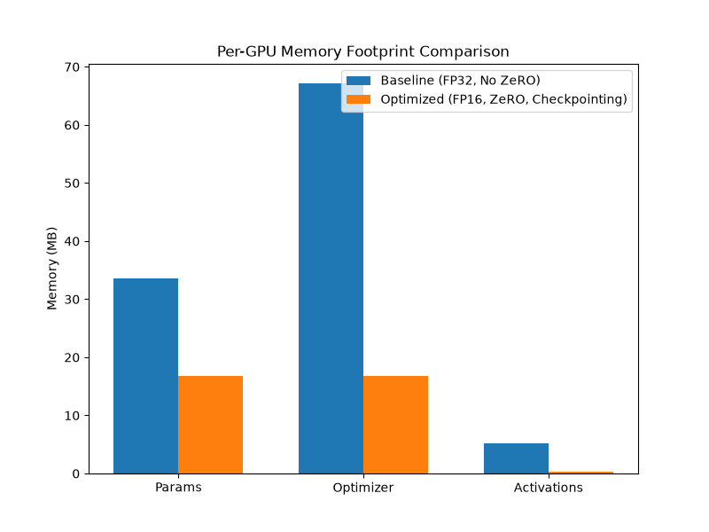

# nanoDist

A production-grade, distributed machine learning training engine implemented entirely from scratch using pure NumPy. It demonstrates advanced memory optimization and parallel computing primitives typically abstracted by large-scale frameworks, scaled down for analytical study and custom infrastructure deployments.

## License Disclaimer
This project is licensed under the **Elastic License 2.0**. By using this software, you agree to all terms and conditions of this license. 
[Read the full Elastic License 2.0 here](LICENSE).

---


---

## Table of Contents
- [nanoDist](#nanodist)
- [Introduction](#introduction)
- [Approach and Methodology](#approach-and-methodology)
- [Conceptual Overview](#conceptual-overview)
- [System Architecture](#system-architecture)
- [Repository Structure](#repository-structure)
- [Technology Stack](#technology-stack)
- [MLOps and Infrastructure](#mlops-and-infrastructure)
- [Environment Setup and Execution](#environment-setup-and-execution)
- [Results, Benchmarks and Evaluation](#results-benchmarks-and-evaluation)
- [Current Status](#current-status)
- [Limitations and Future Work](#limitations-and-future-work)
- [Troubleshooting](#troubleshooting)
- [Support and Maintenance](#support-and-maintenance)
- [Contributing Policy](#contributing-policy)
- [License Summary](#license-summary)
- [Citation Guide](#citation-guide)

---

## Introduction
Modern deep learning models require clusters of GPUs and highly optimized network primitives. `nanoDist` demystifies the underlying mechanics of these massive systems by providing a pure NumPy implementation of Distributed Data Parallelism (DDP), ZeRO optimization, and mixed-precision training. It serves as both a functional training engine and an educational blueprint for distributed systems engineering.

---

## Approach and Methodology
The engine mathematically implements Several state-of-the-art training paradigms:

1. **Distributed Data Parallel (DDP) with Ring All-Reduce**: 
   Standard parameter servers face bandwidth bottlenecks. We implement a Ring All-Reduce algorithm where $N$ nodes communicate in a logical ring. The algorithm operates in two phases: *Reduce-Scatter* and *All-Gather*, ensuring that the total data transmitted per node is asymptotically bounded by $2 \frac{N-1}{N} S$, where $S$ is the parameter size.

2. **ZeRO Stage 2 (Optimizer State Partitioning)**:
   Adam optimizer states (first and second moments) require $8 \times$ the memory of the model parameters. `nanoDist` shards these states across the $N$ available workers. During the update step, worker $i$ updates only its parameter shard $\theta_i$, and an *All-Gather* operation reconstructs the full parameter vector $\theta$.

3. **Activation Checkpointing**:
   During the forward pass, intermediate activation matrices $A_l$ are discarded to minimize peak memory $\max(M_{peak})$. During the backward pass, $A_l$ is selectively recomputed from the nearest checkpointed boundary, sacrificing computing time for a massive reduction in spatial complexity.

4. **Mixed Precision Training**:
   Matrix multiplications are executed in IEEE 754 half-precision (FP16). To prevent gradient underflow during backpropagation ($\frac{\partial L}{\partial W} \approx 0$), the loss $L$ is multiplied by a static scale factor $S$, and gradients are unscaled prior to the FP32 optimizer update.

---

## Conceptual Overview
Conceptually, training massive models requires distributing the parameter load across physical hardware arrays to circumvent memory limits:
- **Distributed Data Parallelism** allows parameter workloads to be partitioned across $N$ processing units, with synchronization achieved via All-Reduce operations.
- **ZeRO Optimizer Partitioning** mathematically distributes optimizer state matrices across the cluster, preventing OOM (Out Of Memory) faults during state tracking.
- **Activation Checkpointing** limits memory consumption by caching only strategic boundary tensors during the forward pass and dynamically recalculating intermediate activations during backpropagation.
- **Mixed Precision** maps tensors to FP16 vectors, halving physical memory footprints while retaining sufficient numeric fidelity via dynamic loss scaling.

---

## System Architecture



The system is designed as a modular pipeline where configuration dictates the execution graph, passing through memory-efficient forward/backward engines before synchronizing across simulated network boundaries and updating sharded states.

---

## Repository Structure

```text
.
├── benchmarks/
│   ├── images/                 # Dynamically generated evaluation plots
│   ├── benchmark_memory.py     # Quantifies FP16/ZeRO memory footprint reductions
│   └── run_hpc_simulation.py   # Simulates multi-node cluster training
├── conf/                       # Hydra YAML configuration manifests
├── docker/                     # Containerization specs for distributed isolation
├── src/distributed_trainer/
│   ├── core/                   # Autograd engine, ML layers, and orchestration loop
│   ├── data/                   # Batch ingestion and distributed sharding logic
│   ├── distributed/            # Peer-to-peer Ring All-Reduce primitives
│   ├── optim/                  # Standard and ZeRO-sharded Adam optimizers
│   ├── optimization/           # Optuna HPO tuning and L2 regularization
│   ├── serving/                # FastAPI endpoints and Base64 Tensor serialization
│   └── utils/                  # Checkpointing and Telemetry integration
├── tests/                      # Pytest unit testing suite for architectural integrity
├── CONTRIBUTING.md             # Standardized contributing guidelines
├── LICENSE                     # Elastic License 2.0
├── Makefile                    # Automation abstractions
├── main.py                     # Primary Hydra-decorated entrypoint
└── pyproject.toml              # UV dependency management specification
```

---

## Technology Stack
- **Compute Engine:** `numpy`
- **Configuration & Orchestration:** `hydra-core`, `omegaconf`
- **Telemetry & Monitoring:** `wandb`, `loguru`
- **Hyperparameter Optimization:** `optuna`
- **Serving & APIs:** `fastapi`, `uvicorn`, `pydantic`
- **Testing & Quality Assurance:** `pytest`, `pytest-cov`, `ruff`, `mypy`, `pre-commit`
- **Dependency Management:** `uv`
- **Containerization:** `docker`, `docker-compose`

---

## MLOps and Infrastructure
The project infrastructure enforces continuous integration and strict deterministic behavior. 
- **CI/CD**: GitHub Actions validate styling via Ruff, static typing via MyPy, and algorithmic correctness via Pytest on every commit.
- **Environment Management**: Resolved deterministically using Astral's `uv` package manager.
- **Pre-commit**: Git hooks intercept malformed code injections automatically.
- **Docker Simulation**: `docker-compose` orchestrates parallel containers to validate distributed networking code in isolation.

---

## Environment Setup and Execution

1. **Prerequisites**: Installation of `uv` is required.
2. **Environment Configuration**: The example environment file should be copied to `.env`.
   ```bash
   cp .env.example .env
   ```
3. **Initialization**: The repository is initialized via the provided Makefile.
   ```bash
   make setup
   ```
4. **Execution**: Training loops are initiated via the command line.
   ```bash
   uv run python main.py
   ```
5. **Validation**: The complete pipeline is executed using the following directive:
   ```bash
   make all
   ```

---

## Results, Benchmarks and Evaluation

The engine's memory constraints are dynamically profiled against standard unoptimized paradigms. The metrics below are automatically updated whenever `make benchmark` is executed.

### Hardware Specifications for Benchmarks
- **CPU**: Intel(R) Core(TM) i7-14650HX (16 Cores, 24 Threads)
- **Memory**: 24 GB RAM
- **GPU**: NVIDIA GeForce RTX 5060 Laptop GPU

<!-- BENCHMARK_METRICS_START -->
| Component | Baseline (MB) | Optimized (MB) |
|-----------|---------------|----------------|
| Parameters | 33.57 | 16.79 |
| Optimizer State | 67.15 | 16.79 |
| Activations | 5.24 | 0.26 |
| **Total per GPU** | **105.97** | **33.84** |

**Total Memory Reduction Ratio:** 68.07%
<!-- BENCHMARK_METRICS_END -->



---

## Current Status
**Stable / Beta**. The core mathematical primitives, distributed orchestrators, and MLOps pipelines are fully functional and passing all automated test suites. 

---

## Limitations and Future Work
- **GPU Acceleration**: The current engine is bound to CPU limits via NumPy. Future work involves transitioning matrix operations to CuPy for CUDA acceleration.
- **Network Layer**: Ring All-Reduce currently operates sequentially in memory. Migration to `asyncio` or PyZMQ is required for true non-blocking TCP socket communication.
- **ZeRO Stage 3**: The engine currently supports Stage 2 (Optimizer State Partitioning). Implementation of Stage 3 (Parameter Partitioning) is slated for the next major release.

---

## Troubleshooting
- **Memory Allocation Errors**: If OOM exceptions occur, reduce `batch_size` in `conf/config.yaml` or enable `use_checkpointing`.
- **Missing WANDB_API_KEY**: The `.env.example` file must be copied to `.env` and populated with a valid Weights & Biases API key. The system defaults to local logging if omitted.
- **Docker Mount Failures**: If running `make docker-up` on Windows, ensure Docker Desktop has file sharing permissions granted for the repository path.

---

## Support and Maintenance
For technical issues, algorithmic discrepancies, or general inquiries, please open an Issue on the GitHub repository utilizing the provided issue templates. Pull Requests are monitored weekly.

---

## Contributing Policy
We adhere to a strict pull-request methodology, mandating PEP-8 formatting and static type checking. 
Please review our formal [Contributing Guide](CONTRIBUTING.md) before submitting patches.

---

## License Summary
This software is provided under the **Elastic License 2.0**.
1. Usage, copying, distribution, and modification of the software are permitted.
2. Providing the software to third parties as a managed or hosted service is prohibited.
3. Circumvention of license key functionalities is prohibited.
4. All copyright and license notices must be preserved.

*(Refer to the [LICENSE](LICENSE) file for legally binding definitions.)*

---

## Citation Guide
If you utilize `nanoDist` in academic research or technical writing, please cite it as follows:

```bibtex
@misc{nanoDist2026,
  author = {Tripathi, Pundarikaksh N.},
  title = {nanoDist: Distributed Training Engine in NumPy},
  year = {2026},
  publisher = {GitHub},
  journal = {GitHub repository},
  howpublished = {\url{https://github.com/PundarikakshNTripathi/nanoDist}}
}
```
